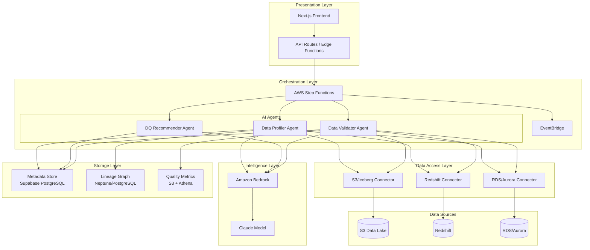
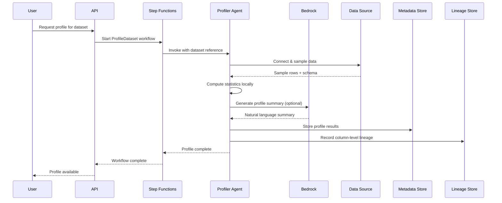
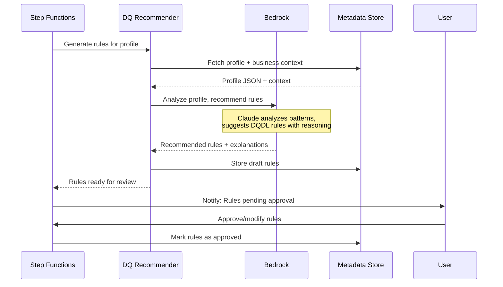
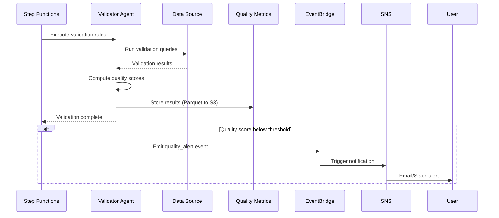
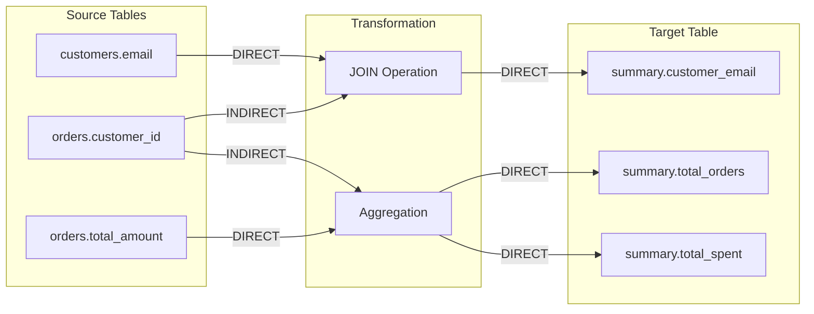

# Architecture Research: AI-Powered Data Quality & Lineage Platform

**Domain:** Data Quality + Lineage Platform with AI Agents
**Researched:** 2026-01-18
**Confidence:** HIGH (verified with AWS official documentation, OpenLineage spec, and industry patterns)

---

## Executive Summary

Modern AI-powered data quality and lineage platforms follow a **layered architecture** with clear separation between:
1. **Presentation Layer** (UI, APIs)
2. **Orchestration Layer** (Agent coordination, workflows)
3. **Intelligence Layer** (AI/LLM processing)
4. **Data Access Layer** (Connectors, profilers)
5. **Storage Layer** (Metadata, lineage graphs, quality metrics)

The key architectural insight for 2025-2026: **Use AWS Step Functions as the orchestration backbone** for multi-agent coordination, with **Amazon Bedrock** for LLM capabilities, and **graph storage (Neptune or PostgreSQL)** for lineage traversal queries.

---

## System Architecture Overview

### High-Level Component Diagram

```
                                    USERS
                                      |
                    +------------------v-------------------+
                    |         PRESENTATION LAYER           |
                    |  +-------------+  +---------------+  |
                    |  | Next.js App |  | API Gateway   |  |
                    |  | (Vercel)    |  | (REST/GraphQL)|  |
                    |  +------+------+  +-------+-------+  |
                    +---------|-----------------|----------+
                              |                 |
                    +---------v-----------------v----------+
                    |        ORCHESTRATION LAYER           |
                    |  +--------------------------------+  |
                    |  |      AWS Step Functions        |  |
                    |  |   (Multi-Agent Coordinator)    |  |
                    |  +---------------+----------------+  |
                    |                  |                   |
                    |  +------+  +-----+-----+  +------+  |
                    |  |Profiler| |DQ Recomm | |Validator| |
                    |  | Agent  | |  Agent   | |  Agent  | |
                    |  +---+----+ +----+-----+ +----+---+  |
                    +------|-----------|-----------|-------+
                           |           |           |
                    +------v-----------v-----------v-------+
                    |        INTELLIGENCE LAYER            |
                    |  +--------------------------------+  |
                    |  |       Amazon Bedrock           |  |
                    |  |  (Claude via Converse API)     |  |
                    |  +--------------------------------+  |
                    +--------------------------------------+
                                      |
                    +-----------------v--------------------+
                    |        DATA ACCESS LAYER             |
                    |  +--------+  +--------+  +--------+  |
                    |  |S3/Icebrg| |Redshift | |RDS/Aurora||
                    |  |Connector| |Connector| |Connector| |
                    |  +----+---+  +----+---+  +----+---+  |
                    +-------|----------|----------|--------+
                            |          |          |
                    +-------v----------v----------v--------+
                    |          STORAGE LAYER               |
                    |  +----------+ +----------+ +-------+ |
                    |  | Metadata | | Lineage  | |Quality| |
                    |  |  Store   | |  Graph   | |Metrics| |
                    |  |(Supabase)| |(Neptune/ | |(S3/TS)| |
                    |  |          | |Postgres) | |       | |
                    |  +----------+ +----------+ +-------+ |
                    +--------------------------------------+
```

### Mermaid Architecture Diagram



---

## Component Boundaries & Responsibilities

### 1. Presentation Layer

| Component | Responsibility | Technology | Communicates With |
|-----------|----------------|------------|-------------------|
| **Next.js Frontend** | User interface, dashboards, agent status | Next.js 14, React Server Components | API Routes, Supabase Realtime |
| **API Routes** | Request handling, authentication, job submission | Vercel Edge Functions | Step Functions, Supabase |
| **Realtime Updates** | Live agent status, progress notifications | Supabase Realtime | Frontend components |

**Boundary Rule:** Presentation layer NEVER directly accesses data sources. All data access goes through Orchestration Layer.

### 2. Orchestration Layer

| Component | Responsibility | Technology | Communicates With |
|-----------|----------------|------------|-------------------|
| **Step Functions** | Agent workflow coordination, state management | AWS Step Functions | Agents, EventBridge, Lambda |
| **EventBridge** | Event routing, trigger-based automation | Amazon EventBridge | Step Functions, SNS, Lambda |
| **Job Queue** | Async job management, retry logic | SQS + Lambda | Step Functions, Agents |

**Boundary Rule:** Orchestration owns ALL workflow state. Agents are stateless executors.

### 3. Intelligence Layer (AI Agents)

| Agent | Responsibility | AWS Services | Inputs | Outputs |
|-------|----------------|--------------|--------|---------|
| **Data Profiler** | Scan datasets, generate statistical profiles | Fargate, Bedrock, S3 | Data source connection, table/dataset reference | Profile JSON (nulls, patterns, distributions, cardinality) |
| **DQ Recommender** | Analyze profiles, recommend validation rules | Bedrock (Claude), Lambda | Profile JSON, business context | DQ Rules (DQDL format), reasoning |
| **Data Validator** | Execute rules, flag issues, compute scores | Batch/Glue, EventBridge | DQ Rules, data source | Validation results, quality scores, alerts |

**Boundary Rule:** Each agent is a single-purpose unit. Agents communicate ONLY through Step Functions, never directly.

### 4. Data Access Layer

| Component | Responsibility | Technology | Data Sources |
|-----------|----------------|------------|--------------|
| **S3/Iceberg Connector** | Read Iceberg tables, access raw files | AWS SDK, PyIceberg | S3 buckets, Iceberg catalogs |
| **Redshift Connector** | Query Redshift, extract metadata | Redshift Data API | Redshift Serverless/Provisioned |
| **RDS/Aurora Connector** | Query relational databases | RDS Data API, pg8000 | PostgreSQL, MySQL on RDS/Aurora |
| **External API Connector** | Fetch data from third-party APIs | HTTP clients | REST APIs, webhooks |

**Boundary Rule:** Connectors handle connection pooling, retries, and credential management. Agents receive clean data interfaces.

### 5. Storage Layer

| Store | Purpose | Technology | Schema/Format |
|-------|---------|------------|---------------|
| **Metadata Store** | Jobs, assets, users, configurations | Supabase PostgreSQL | Relational tables |
| **Lineage Graph** | Column-level lineage, dependency tracking | Neptune OR PostgreSQL with JSONB | OpenLineage-compatible schema |
| **Quality Metrics** | Time-series quality scores, historical trends | S3 (Parquet) + Athena | Star schema for analytics |
| **Profile Cache** | Cached profiling results | DynamoDB or S3 | JSON documents |

---

## Data Flow Patterns

### Pattern 1: Profiling Flow



### Pattern 2: DQ Rule Generation Flow



### Pattern 3: Validation Flow



### Pattern 4: Column-Level Lineage Flow



---

## Recommended Storage Schemas

### Lineage Graph Schema (OpenLineage-Compatible)

```sql
-- Core lineage tables (PostgreSQL with JSONB for flexibility)

CREATE TABLE datasets (
    id UUID PRIMARY KEY DEFAULT gen_random_uuid(),
    namespace VARCHAR(255) NOT NULL,        -- e.g., 's3://bucket' or 'redshift://cluster'
    name VARCHAR(500) NOT NULL,             -- e.g., 'schema.table'
    physical_name VARCHAR(500),             -- actual table name
    source_type VARCHAR(50),                -- S3, REDSHIFT, RDS, etc.
    schema_fields JSONB,                    -- column definitions
    created_at TIMESTAMP DEFAULT NOW(),
    updated_at TIMESTAMP DEFAULT NOW(),
    UNIQUE(namespace, name)
);

CREATE TABLE dataset_fields (
    id UUID PRIMARY KEY DEFAULT gen_random_uuid(),
    dataset_id UUID REFERENCES datasets(id),
    name VARCHAR(255) NOT NULL,
    type VARCHAR(100),
    ordinal_position INTEGER,
    description TEXT,
    tags JSONB,                             -- PII, sensitive, etc.
    UNIQUE(dataset_id, name)
);

CREATE TABLE lineage_edges (
    id UUID PRIMARY KEY DEFAULT gen_random_uuid(),
    source_field_id UUID REFERENCES dataset_fields(id),
    target_field_id UUID REFERENCES dataset_fields(id),
    transformation_type VARCHAR(50),        -- DIRECT, INDIRECT, AGGREGATION
    transformation_description TEXT,
    job_id UUID,                            -- which job created this edge
    created_at TIMESTAMP DEFAULT NOW()
);

CREATE TABLE jobs (
    id UUID PRIMARY KEY DEFAULT gen_random_uuid(),
    namespace VARCHAR(255) NOT NULL,
    name VARCHAR(500) NOT NULL,
    job_type VARCHAR(50),                   -- PROFILE, VALIDATE, ETL
    facets JSONB,                           -- OpenLineage facets
    created_at TIMESTAMP DEFAULT NOW()
);

CREATE TABLE runs (
    id UUID PRIMARY KEY DEFAULT gen_random_uuid(),
    job_id UUID REFERENCES jobs(id),
    state VARCHAR(50),                      -- RUNNING, COMPLETED, FAILED
    started_at TIMESTAMP,
    ended_at TIMESTAMP,
    facets JSONB                            -- run-level metadata
);

-- Index for lineage traversal queries
CREATE INDEX idx_lineage_source ON lineage_edges(source_field_id);
CREATE INDEX idx_lineage_target ON lineage_edges(target_field_id);
CREATE INDEX idx_dataset_namespace ON datasets(namespace);
```

### Quality Metrics Schema (Time-Series)

```sql
-- Quality metrics for time-series analysis

CREATE TABLE quality_scores (
    id UUID PRIMARY KEY DEFAULT gen_random_uuid(),
    dataset_id UUID REFERENCES datasets(id),
    field_id UUID REFERENCES dataset_fields(id),  -- NULL for table-level
    dimension VARCHAR(50) NOT NULL,         -- completeness, validity, uniqueness, etc.
    score DECIMAL(5,4),                     -- 0.0000 to 1.0000
    rule_id UUID,                           -- which rule generated this
    run_id UUID REFERENCES runs(id),
    measured_at TIMESTAMP DEFAULT NOW()
);

CREATE TABLE dq_rules (
    id UUID PRIMARY KEY DEFAULT gen_random_uuid(),
    dataset_id UUID REFERENCES datasets(id),
    field_id UUID REFERENCES dataset_fields(id),
    rule_type VARCHAR(50),                  -- COMPLETENESS, VALIDITY, etc.
    rule_expression TEXT,                   -- DQDL expression
    threshold DECIMAL(5,4),
    reasoning TEXT,                         -- AI-generated explanation
    status VARCHAR(20) DEFAULT 'draft',     -- draft, approved, disabled
    created_by VARCHAR(100),
    approved_by VARCHAR(100),
    created_at TIMESTAMP DEFAULT NOW()
);

-- Partition by time for efficient querying
CREATE INDEX idx_quality_time ON quality_scores(measured_at);
CREATE INDEX idx_quality_dataset ON quality_scores(dataset_id, measured_at);
```

---

## AWS Step Functions State Machine Design

### Multi-Agent Orchestration Pattern

```yaml
# ProfileAndRecommend State Machine
Comment: "Orchestrates profiling and DQ rule recommendation"
StartAt: ValidateInput
States:
  ValidateInput:
    Type: Choice
    Choices:
      - Variable: "$.datasetRef"
        IsPresent: true
        Next: ProfileData
    Default: FailInvalidInput

  ProfileData:
    Type: Task
    Resource: "arn:aws:states:::ecs:runTask.sync"
    Parameters:
      Cluster: "${EcsCluster}"
      TaskDefinition: "${ProfilerTaskDef}"
      LaunchType: FARGATE
      Overrides:
        ContainerOverrides:
          - Name: profiler
            Environment:
              - Name: DATASET_REF
                Value.$: "$.datasetRef"
    ResultPath: "$.profileResult"
    Retry:
      - ErrorEquals: ["States.TaskFailed"]
        MaxAttempts: 2
        BackoffRate: 2
    Catch:
      - ErrorEquals: ["States.ALL"]
        Next: HandleProfileError
    Next: GenerateRules

  GenerateRules:
    Type: Task
    Resource: "arn:aws:states:::bedrock:invokeModel"
    Parameters:
      ModelId: "anthropic.claude-sonnet-4-20250514"
      ContentType: "application/json"
      Body:
        anthropic_version: "bedrock-2023-05-31"
        messages:
          - role: user
            content.$: "States.Format('Analyze this data profile and recommend DQ rules in DQDL format: {}', $.profileResult)"
        max_tokens: 4096
    ResultPath: "$.rulesResult"
    Next: HumanReview

  HumanReview:
    Type: Task
    Resource: "arn:aws:states:::sqs:sendMessage.waitForTaskToken"
    Parameters:
      QueueUrl: "${ApprovalQueueUrl}"
      MessageBody:
        taskToken.$: "$$.Task.Token"
        rules.$: "$.rulesResult"
        datasetRef.$: "$.datasetRef"
    TimeoutSeconds: 86400  # 24 hour approval window
    Next: StoreApprovedRules

  StoreApprovedRules:
    Type: Task
    Resource: "arn:aws:lambda:invoke"
    Parameters:
      FunctionName: "${StoreRulesFunction}"
      Payload.$: "$"
    End: true

  HandleProfileError:
    Type: Task
    Resource: "arn:aws:states:::sns:publish"
    Parameters:
      TopicArn: "${AlertTopicArn}"
      Message.$: "States.Format('Profile failed for dataset: {}', $.datasetRef)"
    Next: FailState

  FailInvalidInput:
    Type: Fail
    Error: "InvalidInput"
    Cause: "Dataset reference is required"

  FailState:
    Type: Fail
    Error: "ProfileFailed"
```

---

## Architectural Patterns

### Pattern 1: Supervisor Agent Orchestration

**What:** A central Step Functions workflow coordinates specialized agents, managing state and context passing.

**When to use:** Complex multi-step workflows requiring human-in-the-loop approval, error handling, and audit trails.

**Implementation:**
```
Step Functions (Supervisor)
    |
    +---> Profile Agent (ECS Task)
    |         |
    |         +---> Returns profile JSON
    |
    +---> DQ Recommender (Bedrock InvokeModel)
    |         |
    |         +---> Returns rules + reasoning
    |
    +---> Human Review (SQS waitForTaskToken)
    |         |
    |         +---> Returns approved rules
    |
    +---> Validator Agent (Batch Job)
              |
              +---> Returns validation results
```

**Trade-offs:**
- PRO: Full visibility, audit trail, retry handling
- PRO: Native AWS integration, no custom orchestration code
- CON: Cold start latency for ECS tasks
- CON: Step Functions state size limits (256KB)

### Pattern 2: Event-Driven Quality Pipeline

**What:** EventBridge triggers quality workflows based on data events (new files, schema changes).

**When to use:** Continuous data quality monitoring, automated validation on data arrival.

**Implementation:**
```
S3 PutObject Event
    |
    v
EventBridge Rule (filter: *.parquet in /raw/)
    |
    v
Step Functions (ProfileAndValidate)
    |
    +---> Profile new data
    +---> Validate against existing rules
    +---> Publish quality scores
    +---> Alert if below threshold
```

**Trade-offs:**
- PRO: Zero-latency trigger on data events
- PRO: Decoupled, scalable
- CON: Must handle duplicate events
- CON: Complex debugging across event chains

### Pattern 3: Graph-Based Lineage Traversal

**What:** Store lineage as edges in a graph database for efficient impact analysis queries.

**When to use:** When users need to answer "What is affected if column X changes?" or "Where does this data come from?"

**Implementation Options:**

| Option | Query Example | Performance | Complexity |
|--------|---------------|-------------|------------|
| **Amazon Neptune** | Gremlin/SPARQL | Best for deep traversal (5+ hops) | High (separate service) |
| **PostgreSQL + Recursive CTE** | SQL with WITH RECURSIVE | Good for shallow (2-3 hops) | Low (use existing Supabase) |
| **DynamoDB + Adjacency List** | Scan + filter | Fast single-hop, poor multi-hop | Medium |

**Recommendation:** Start with PostgreSQL + recursive CTEs in Supabase. Migrate to Neptune only if traversal performance becomes a bottleneck (typically >10K lineage edges).

```sql
-- Upstream lineage query (find all sources)
WITH RECURSIVE upstream AS (
    SELECT source_field_id, target_field_id, 1 as depth
    FROM lineage_edges
    WHERE target_field_id = :starting_field_id

    UNION ALL

    SELECT e.source_field_id, e.target_field_id, u.depth + 1
    FROM lineage_edges e
    JOIN upstream u ON e.target_field_id = u.source_field_id
    WHERE u.depth < 10  -- prevent infinite loops
)
SELECT DISTINCT source_field_id FROM upstream;
```

---

## Anti-Patterns to Avoid

### Anti-Pattern 1: Agents Calling Agents Directly

**What people do:** Profiler agent directly invokes DQ Recommender agent via HTTP/Lambda.

**Why it's wrong:**
- No central state management
- No retry/error handling
- No audit trail
- Tight coupling makes changes risky

**Do this instead:** All agent-to-agent communication goes through Step Functions. Agents are stateless and unaware of each other.

### Anti-Pattern 2: Storing Lineage in Flat Tables

**What people do:** Store lineage as source_table -> target_table without column granularity.

**Why it's wrong:**
- Cannot answer "Which columns affect my metric?"
- Cannot track PII propagation
- Cannot do precise impact analysis

**Do this instead:** Store column-level lineage with transformation types (DIRECT, INDIRECT, AGGREGATION) using OpenLineage schema.

### Anti-Pattern 3: Synchronous Quality Checks in Data Pipeline

**What people do:** Block ETL pipeline waiting for quality validation to complete.

**Why it's wrong:**
- Single failure stops all data flow
- Quality checks add latency to critical path
- Cannot handle long-running validations

**Do this instead:** Use event-driven pattern with dead-letter queues. Data lands in "quarantine" zone, validated asynchronously, then promoted to "trusted" zone.

### Anti-Pattern 4: Monolithic Agent

**What people do:** One large agent that profiles, recommends rules, AND validates.

**Why it's wrong:**
- Cannot scale components independently
- One failure takes down everything
- Cannot run profiling on Fargate while validation needs Batch

**Do this instead:** Single-responsibility agents. Profiler only profiles. Recommender only recommends. Validator only validates.

---

## Build Order Implications

Based on architectural dependencies, recommended build sequence:

### Phase 1: Foundation (Build First)

```
Storage Layer
    |
    +---> Supabase setup (metadata tables, auth)
    +---> S3 buckets (raw data, quality metrics)
    +---> Basic schema (datasets, fields, runs)
```

**Rationale:** Everything depends on storage. Cannot build agents without somewhere to store results.

### Phase 2: Single Agent (Validate Architecture)

```
Data Access Layer
    |
    +---> S3/Iceberg connector
    +---> Profiler Agent (Fargate)
    +---> Simple Step Functions workflow
    +---> API endpoint to trigger
```

**Rationale:** Prove the architecture with one end-to-end flow before building all agents.

### Phase 3: Intelligence Integration

```
Intelligence Layer
    |
    +---> Bedrock integration
    +---> DQ Recommender Agent
    +---> Human-in-the-loop workflow
```

**Rationale:** AI integration is highest risk. Get profiling working first.

### Phase 4: Full Pipeline

```
Orchestration Layer
    |
    +---> Validator Agent
    +---> EventBridge triggers
    +---> Quality alerting (SNS)
    +---> Multi-agent workflow
```

**Rationale:** Validation depends on rules from Recommender. Build last.

### Phase 5: Lineage

```
Lineage Storage
    |
    +---> Column-level lineage schema
    +---> Lineage capture in Profiler
    +---> Lineage UI components
```

**Rationale:** Lineage is additive. Platform works without it. Add once core quality workflow is stable.

---

## Scaling Considerations

| Scale | Architecture Adjustments |
|-------|--------------------------|
| **0-100 datasets** | Single Fargate task, Supabase PostgreSQL for lineage, synchronous workflows |
| **100-1K datasets** | Parallel Step Functions executions, DynamoDB for profile cache, async validation |
| **1K-10K datasets** | Neptune for lineage, Batch for validation, partitioned quality metrics in S3 |
| **10K+ datasets** | Multi-region, dedicated lineage service, materialized impact analysis views |

### First Bottleneck: Profile Storage

When profile results exceed 1MB per dataset, move from Supabase to DynamoDB with S3 overflow.

### Second Bottleneck: Lineage Queries

When lineage graph exceeds 100K edges, recursive CTEs in PostgreSQL become slow. Migrate to Neptune.

### Third Bottleneck: Concurrent Validations

When running >50 concurrent validations, move from Fargate to AWS Batch with spot instances.

---

## Integration Points

### External Services

| Service | Integration Pattern | Notes |
|---------|---------------------|-------|
| **Amazon Bedrock** | Direct API via SDK or Step Functions integration | Use Converse API for tool use |
| **S3/Iceberg** | PyIceberg library + AWS SDK | Support time-travel queries |
| **Redshift** | Redshift Data API (async) | Avoid long-running connections |
| **Supabase** | PostgreSQL client + Realtime subscription | Use connection pooling |
| **EventBridge** | Event patterns + rules | Filter events to reduce noise |

### Internal Boundaries

| Boundary | Communication | Notes |
|----------|---------------|-------|
| Frontend <-> Backend | REST API via Vercel Edge Functions | Use tRPC for type safety |
| API <-> Orchestration | Step Functions StartExecution | Pass job ID, poll for status |
| Orchestration <-> Agents | ECS RunTask / Lambda Invoke | Stateless, pass all context |
| Agents <-> Storage | Direct database connection | Agents have write access to specific tables |
| Agents <-> Data Sources | Connector abstraction | Credentials from Secrets Manager |

---

## Technology Decision Matrix

| Component | Recommended | Alternative | Why Recommended |
|-----------|-------------|-------------|-----------------|
| **Agent Orchestration** | Step Functions | Temporal, Airflow | Native AWS, visual debugging, waitForTaskToken |
| **Agent Compute** | Fargate | Lambda, ECS | Right-sized containers, no cold start for profiles |
| **Heavy Validation** | AWS Batch | Glue, EMR | Cost-effective for large datasets, spot support |
| **Lineage Storage** | PostgreSQL (start) | Neptune (scale) | Simpler ops, recursive CTEs work for <100K edges |
| **Quality Metrics** | S3 Parquet + Athena | TimescaleDB, InfluxDB | Serverless, cost-effective for historical analysis |
| **Profile Cache** | DynamoDB | Redis, S3 | Single-digit ms reads, scales automatically |
| **AI/LLM** | Bedrock (Claude) | OpenAI, local | AWS-native, no data leaves AWS, tool use support |

---

## Sources

### Official Documentation
- [AWS Step Functions AI Orchestration](https://aws.amazon.com/blogs/machine-learning/orchestrate-generative-ai-workflows-with-amazon-bedrock-and-aws-step-functions/)
- [AWS Glue Data Quality](https://docs.aws.amazon.com/glue/latest/dg/glue-data-quality.html)
- [Amazon DataZone Lineage (OpenLineage)](https://docs.aws.amazon.com/datazone/latest/userguide/datazone-data-lineage.html)
- [Amazon Bedrock Agents Lambda](https://docs.aws.amazon.com/bedrock/latest/userguide/agents-lambda.html)

### OpenLineage Resources
- [OpenLineage Column-Level Lineage Facet](https://openlineage.io/docs/spec/facets/dataset-facets/column_lineage_facet/)
- [OpenLineage GitHub](https://github.com/OpenLineage/OpenLineage)
- [OpenLineage Architecture (Atlan)](https://atlan.com/open-lineage/)

### AWS Architecture Patterns
- [Multi-Agent Orchestration on AWS](https://aws.amazon.com/solutions/guidance/multi-agent-orchestration-on-aws/)
- [AWS Prescriptive Guidance: Agentic AI Patterns](https://docs.aws.amazon.com/prescriptive-guidance/latest/agentic-ai-patterns/workflow-orchestration-agents.html)
- [DZone: Multi-Agent Orchestration with Step Functions](https://dzone.com/articles/multi-agent-multi-function-orchestration-with-aws)
- [XenonStack: Multi-Agent Systems with AWS Step Functions](https://www.xenonstack.com/blog/multi-agent-systems-with-aws)

### Data Quality Architecture
- [DQOps: Data Architecture for Data Quality](https://dqops.com/data-architecture-for-data-quality/)
- [Alation: Data Pipeline Architecture Patterns](https://www.alation.com/blog/data-pipeline-architecture-patterns/)
- [AWS: Lakehouse Architecture with Glue Data Quality](https://aws.amazon.com/blogs/big-data/accelerate-your-data-quality-journey-for-lakehouse-architecture-with-amazon-sagemaker-apache-iceberg-on-aws-amazon-s3-tables-and-aws-glue-data-quality/)

### Graph Storage for Lineage
- [Informatica Neptune Knowledge Graphs](https://aws.amazon.com/blogs/database/how-informatica-cloud-data-governance-and-catalog-uses-amazon-neptune-for-knowledge-graphs/)
- [NebulaGraph Metadata Governance](https://www.nebula-graph.io/posts/metadata-governance-graph-database-data-lineage)

### Event-Driven Patterns
- [EventBridge Event-Driven Architecture](https://dasroot.net/posts/2026/01/aws-eventbridge-event-driven-architecture/)
- [EventBridge Pipes Enrichment](https://aws.amazon.com/blogs/compute/enriching-and-customizing-notifications-with-amazon-eventbridge-pipes/)

---

*Architecture research for: Data Reply Agentic Platform - Data Quality & Lineage*
*Researched: 2026-01-18*
